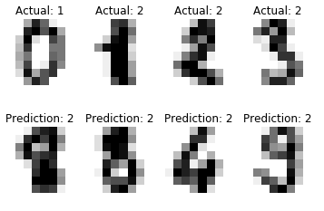

# Overview
This project aims at classifying the digits in the MNIST dataset into two categories - **zero and non-zero**. For the purpose of classification, SVM and CNN have been implemented. Each of them are implemented in different Jupyter notebooks.

# Example

